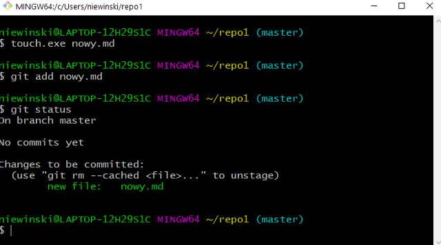
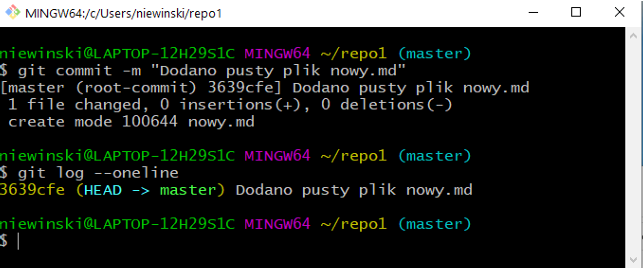
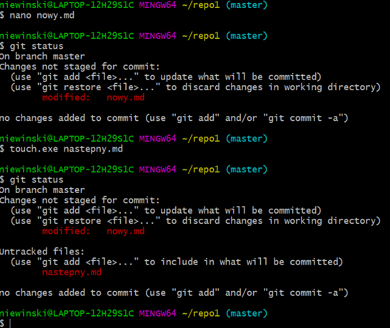
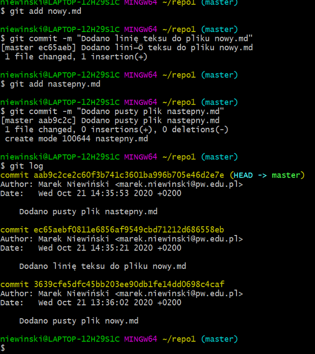

# Lekcja 2 – Git – system kontroli wersji

Jest to oprogramowanie służące do śledzenia zmian (głównie w dokumentach tekstowych) podczas pracy zespołów wieloosobowych dokonujących zmian w różnym czasie i miejscach przebywania.

## Git - podstawowe cechy

- Efektywna praca z dużymi projektami - jest jednym z najszybszych systemów kontroli wersji
- Wsparcie dla protokołów sieciowych - dane można wymieniać przez HTTP(S), FTP, rsync, SSH, e-mail
- Każda kopia repozytorium to obraz całego projektu - Git nie zapamiętuje zmian między kolejnymi rewizjami lecz kompletne obrazy (snapshots)
- Możliwość tworzenia oprogramowania z rozgałęzieniami
- Tryb pracy off-line - każdy pracuje na własnej kopii repozytorium, a następnie zmiany mogą być wymieniane między lokalnymi repozytoriami jak również serwerem

## Idea pracy

Na powyższym rysunku symbolicznie przedstawiono zasadę pracy z gitem. Większy okrąg symbolizuje repozytorium lokalne (po lewej) w którym pracuje użytkownik. Mniejszy okrąg (po prawej) to kopia repozytorium na wybranym serwerze (np. github.com lub gitlab.com). Czerwone strzałki to komendy git'a, które powodują przenoszenie plików i/lub katalogów pomiędzy poszczególnymi elementami repozytorium lub pomiędzy maszyną lokalną a serwerem.

Git rozróżnia trzy typy plików w repozytorium lokalnym: nadzorowane, pomijane i nienadzorowane. Z punktu widzenia systemu plików repozytorium to zwykły katalog w którym zainicjalizowany został specjalny podkatalog o nazwie .git, w którym przetrzymywane są wszystkie informacje o repozytorium.

Użytkownik pracuje w katalogu roboczym, gdzie modyfikuje swoje pliki. Gdy uzna, że postęp prac wymaga zapisania zmian przenosi je do staging area (komenda add). Gdy suma zmian stanowi jakąś spójną całość (np. dodanie nowego rozdziału pracy, dodanie nowej funkcjonalności itd.) tworzy się nową "migawkę" zapisywaną w lokalnym repozytorium (komenda commit). Co jakiś czas można przenieść lokalne zmiany w repozytorium na serwer (komenda push).

Uwaga: Do pracy z systemem git należy zainstalować oprogramowanie ze strony:
https://git-scm.com/downloads

Po zainstalowaniu będzie dostępna powłoka z wyglądu podobna do tej z poniższego rysunku. Jest to aplikacja **Git Bash** w której wydajemy polecenia z linii komend.

Pierwszym krokiem po instalacji git'a i uruchomieniu aplikacji Git Bash jest wydanie dwóch poleceń:

$git config --global user.name "Student Wspanialy"

$git config --global user.email "wspanialy@pw.edu.pl"

W ten sposób informujemy system git kto będzie autorem zmian wprowadzanych do repozytorium.

Uwaga: należy wprowadzić własne dane osobowe i własny adres e-mail

W przypadku piszącego tą instrukcję wynik wprowadzonych komend ma postać:

## Git – tworzenie pustego archiwum lokalnego
Należy w konsoli wywołać następującą sekwencję komend (zakładając, że repozytorium będzie nosiło nazwę repo1):

1. **$ mkdir repo1**
2. **$ cd repo1**
3. **$ git init**
4. **$ git status**

* Pierwsza komenda tworzy katalog o zadanej nazwie
* Druga komenda powoduje, że przechodzimy do właśnie stworzonego katalogu
* Trzecia komenda inicjuje puste repozytorium
* Czwarta komenda wyświetla informacje o stanie repozytorium

Jak widać na powyższym rysunku po stworzeniu pustego repozytorium pracujemy w głównej gałęzi
**master** i brak jest zarejestrowanych jakichkolwiek „migawek” (commits)

Dodawanie pliku/ów do indeksu
- $ git add file - dodanie pliku do indeksu
- $ git rm --cached file - usunięcie pliku z indeksu

Powyższy rysunek prezentuje sekwencję komend:
1. $touch.exe nowy.md – utworzenie pustego pliku tekstowego
2. $git add nowy.md – dodanie nowo stworzonego pliku do indeksu
3. $git status – wyświetlenie statusu lokalnego repozytorium

Widać (zielony kolor), że git śledzi wprowadzone zmiany.

Git - zapis pliku do repozytorium lokalnego

- git commit -m "komunikat" – w komunikacie podaje się krótki opis zmian wprowadzonych do repozytorium

Polecenie git log wyświetla listę zapisanych "migawek". Każda migawka identyfikowana jest sekwencją liczb szesnastkowych (żółte cyfry) – komentarzem jaki podajemy podczas wywoływania polecenia git commit.

**Git – dodanie kolejnych plików, modyfikacja i stworzenie kolejnych "migawek"**

Używając tekstowego edytora nano (można użyć własnego ulubionego edytora) – zmodyfikowano zawartość pliku nowy.md – co natychmiast zauważył system kontroli wersji (modified nowy.md). Następnie stworzono kolejny pusty plik (następny.md) co również system zasygnalizował jako: (Untracked files – następny.md). Teraz zostaną wykonane dwa niezależne commity i zostanie wyświetlony kolejny log stanu repozytorium.

Jak widać na kolejnym rysunku w repozytorium zostały umieszczone trzy "migawki" stanu repozytorium wszystkie umieszczone w gałęzi głównej "master".

**Git – praca z rozgałęzieniami**

Bardzo często zachodzi taka sytuacja, że nie chcemy wprowadzać zmian w głównej gałęzi a tylko wykonać jakieś prace testowe i później zdecydować czy dołączyć je do głównej gałęzi lub nie. Do tego służą rozgałęzienia i operacja ich łączenia.

- $git branch name – tworzenie nowego rozgałęzienia
- $git checkout name - przełączenie się do innej gałęzi
- $git branch -D name - usunięcie rozgałęzienia (trzeba być od niego odłączonym)
- $git merge nazwa_galezi – złączenie gałęzi "nazwa_galezi" z gałęzią do której jesteśmy podłączeni

